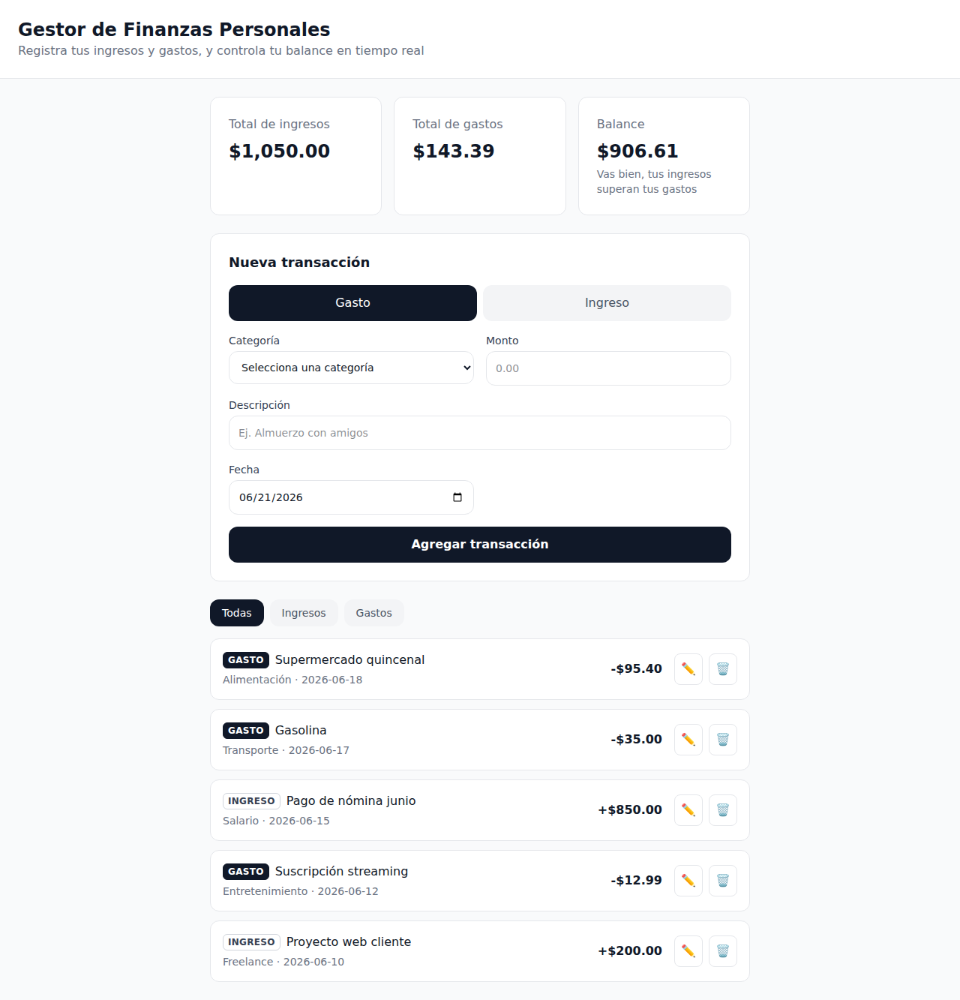
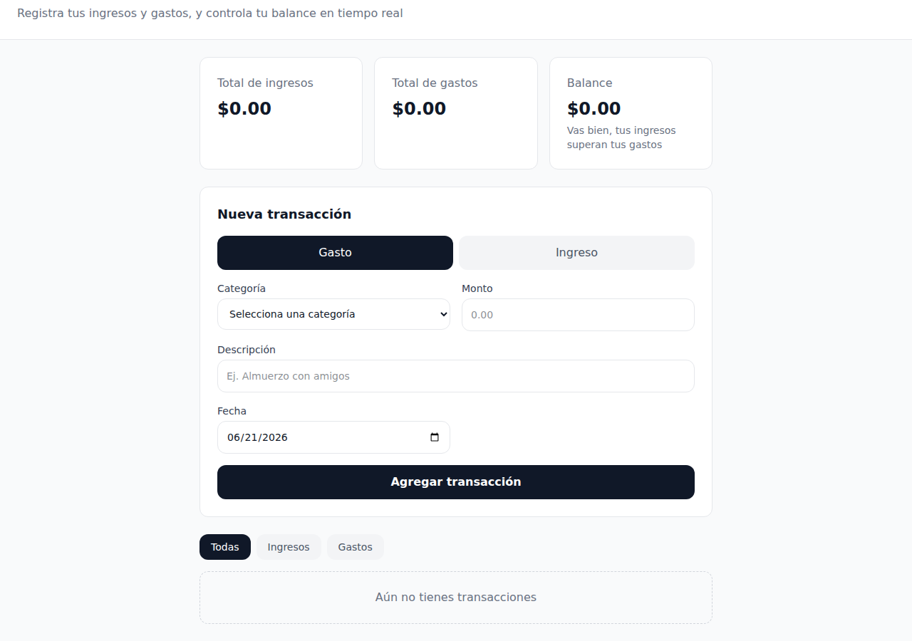
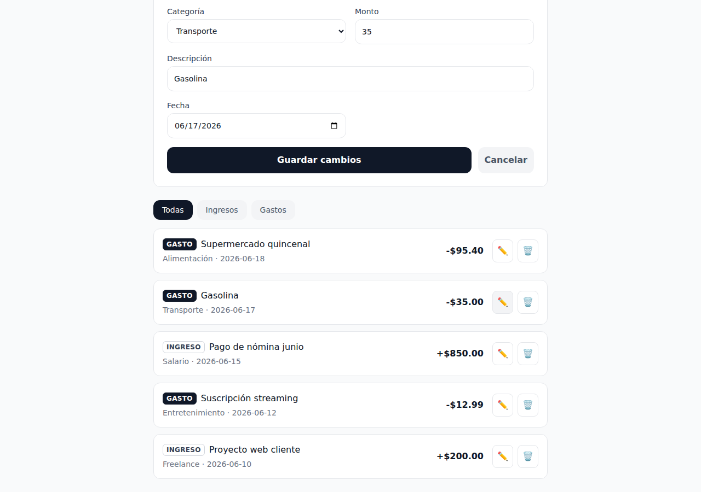

# Gestor de Finanzas Personales

Aplicación web para registrar ingresos y gastos personales, ver el balance en tiempo real y entender en qué se va el dinero. Funciona completamente en el navegador: no requiere backend ni base de datos, toda la información se guarda en `localStorage`.



## Características

- ✅ Registrar transacciones (ingreso o gasto) con categoría, descripción, monto y fecha.
- ✅ Listado de transacciones ordenado por fecha (más recientes primero).
- ✅ Eliminar transacciones con confirmación.
- ✅ **Editar transacciones existentes** (funcionalidad opcional implementada).
- ✅ Resumen financiero en tiempo real: total de ingresos, total de gastos y balance.
- ✅ **Filtrar por tipo:** Todas / Ingresos / Gastos (funcionalidad opcional implementada).
- ✅ Persistencia automática en `localStorage`.
- ✅ Diseño responsive (móvil 320px y desktop 1024px+).
- ✅ Suite de tests con Vitest + React Testing Library.

## Stack tecnológico

- **React 18** + **TypeScript**
- **Vite** como build tool
- **Tailwind CSS** para todos los estilos
- **Vitest** + **React Testing Library** para testing
- **localStorage** del navegador como única persistencia

## Capturas de pantalla

| Estado vacío | Formulario de edición |
|---|---|
|  |  |

## Estructura del proyecto

```
src/
├── components/
│   ├── FormularioTransaccion.tsx
│   ├── ListaTransacciones.tsx
│   ├── TarjetaTransaccion.tsx
│   └── ResumenFinanciero.tsx
├── utils/
│   └── finanzas.ts        ← funciones puras: calcular, filtrar, formatear
├── hooks/
│   └── useTransacciones.ts ← lógica de localStorage
├── types/
│   └── index.ts            ← interfaces TypeScript
├── tests/
│   ├── setup.ts
│   └── *.test.tsx
├── App.tsx
└── main.tsx
```

## Instrucciones para correrlo localmente

### 1. Clonar el repositorio

```bash
git clone https://github.com/TU_USUARIO/gestor-finanzas.git
cd gestor-finanzas
```

### 2. Instalar dependencias

```bash
npm install
```

### 3. Levantar el servidor de desarrollo

```bash
npm run dev
```

La aplicación quedará disponible en `http://localhost:5173`.

### 4. Compilar para producción

```bash
npm run build
npm run preview
```

### 5. Ejecutar los tests

```bash
# Modo watch
npm run test

# Una sola ejecución (usado en CI)
npm run test:run
```

## Cómo se construyó este proyecto desde cero

Estos son los comandos exactos usados para crear el proyecto, por si quieres reproducirlo o entender cada paso:

```bash
# 1. Crear el proyecto con Vite + React + TypeScript
npm create vite@latest gestor-finanzas -- --template react-ts
cd gestor-finanzas
npm install

# 2. Fijar React en versión 18 (el template trae React 19 por defecto)
npm install react@18.3.1 react-dom@18.3.1
npm install -D @types/react@18.3.1 @types/react-dom@18.3.1

# 3. Agregar Tailwind CSS
npm install -D tailwindcss @tailwindcss/vite
# en vite.config.ts:  plugins: [react(), tailwindcss()]
# en src/index.css:   @import "tailwindcss";

# 4. Agregar Vitest + Testing Library
npm install -D vitest@2.1.1 jsdom@25.0.0
npm install -D @testing-library/react@16.0.0
npm install -D @testing-library/user-event@14.5.2
npm install -D @testing-library/jest-dom@6.4.6
```

A partir de ahí se crearon manualmente las carpetas `components/`, `utils/`, `hooks/`, `types/` y `tests/`, y se implementaron los requerimientos funcionales (RF-01 a RF-07) y técnicos (RT-01 a RT-05) del documento de requerimientos.

## Despliegue en Vercel

1. Sube el repositorio a GitHub (ver sección siguiente).
2. Entra a [vercel.com](https://vercel.com) e importa el repositorio.
3. Vercel detecta automáticamente que es un proyecto Vite — no requiere configuración adicional.
4. Build command: `npm run build` · Output directory: `dist`.
5. Despliega y copia la URL pública generada.

**URL del despliegue:** _agregar aquí la URL de Vercel una vez desplegado_

## Subir el proyecto a GitHub

```bash
git init
git add .
git commit -m "Proyecto inicial: Gestor de Finanzas Personales"
git branch -M main
git remote add origin https://github.com/TU_USUARIO/gestor-finanzas.git
git push -u origin main
```

## Requerimientos cubiertos

| Código | Requerimiento | Estado |
|---|---|---|
| RF-01 | Registrar una transacción | ✅ |
| RF-02 | Listar todas las transacciones | ✅ |
| RF-03 | Eliminar una transacción | ✅ |
| RF-04 | Editar una transacción (opcional) | ✅ |
| RF-05 | Mostrar resumen financiero | ✅ |
| RF-06 | Persistir datos en localStorage | ✅ |
| RF-07 | Filtrar por tipo (opcional) | ✅ |
| RT-01 a RT-05 | Stack, estructura, tipos, diseño y calidad | ✅ |
| TS-01 / TS-02 | Suite de tests (13 tests, AAA, userEvent) | ✅ |

## Tests incluidos

| Archivo | Tests |
|---|---|
| `finanzas.calcularResumen.test.ts` | 3 |
| `finanzas.filtrarPorTipo.test.ts` | 2 |
| `TarjetaTransaccion.test.tsx` | 3 |
| `FormularioTransaccion.test.tsx` | 3 |
| `ListaTransacciones.test.tsx` | 2 |
| **Total** | **13 tests** |

```bash
npm run test:run

 ✓ src/tests/FormularioTransaccion.test.tsx  (3 tests)
 ✓ src/tests/TarjetaTransaccion.test.tsx  (3 tests)
 ✓ src/tests/finanzas.calcularResumen.test.ts  (3 tests)
 ✓ src/tests/ListaTransacciones.test.tsx  (2 tests)
 ✓ src/tests/finanzas.filtrarPorTipo.test.ts  (2 tests)

 Test Files  5 passed (5)
      Tests  13 passed (13)
```

## Autor

Pablo — Estudiante de Sistemas y Ciberseguridad, ESINTEC.
